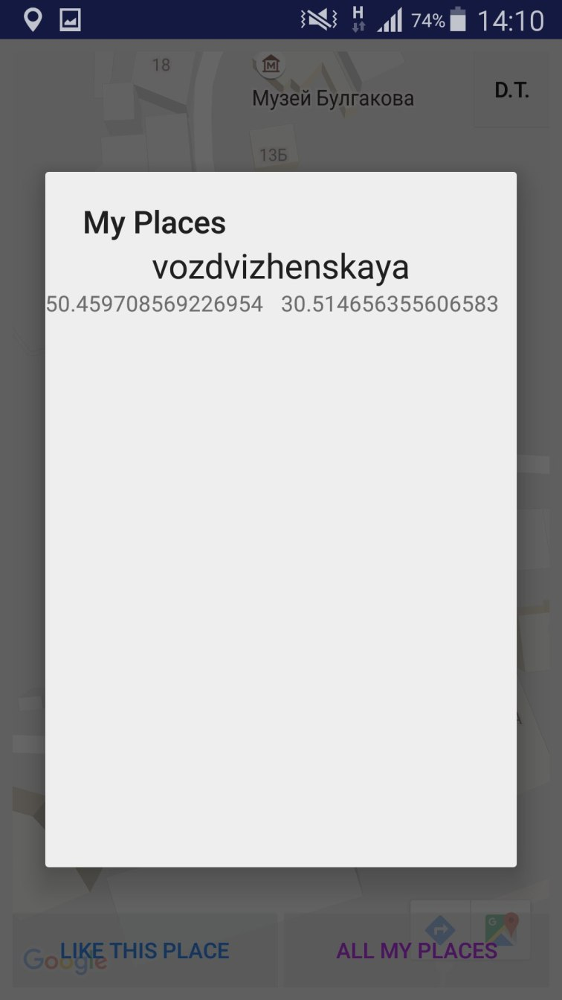

# FavoritePlaces
Application track your current location and by pressing the button "Like this place" you can add some tag (descroption to place), 
and then it will be saved to local SQLite DataBase. Also you can see all you "Liked places" on GoogleMaps.

#Screenshots      
###Whole Planet available for you

###Tag place

###Your place on GoogleMaps

###All seved places

